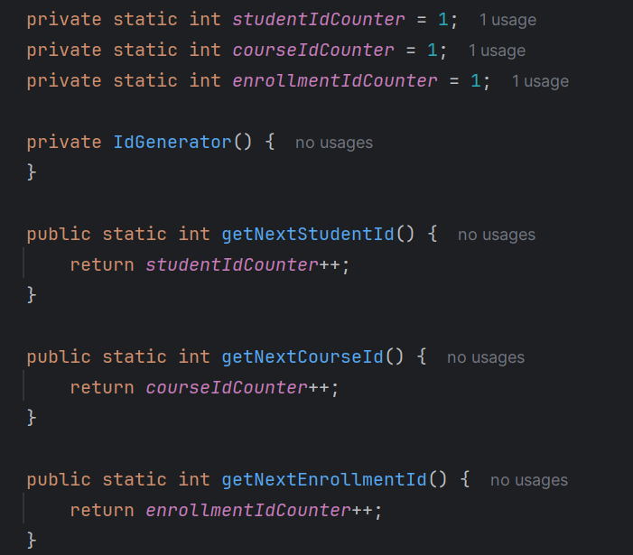
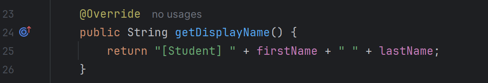

# LearnTrack Design Notes

## Why ArrayList instead of array?

**ArrayList** was chosen over traditional arrays for dynamic data storage in repositories. Key reasons:

- **Dynamic resizing**: Arrays have fixed size (e.g., `Student[] students = new Student[100]`), but we don't know how many students/courses will be added. ArrayList automatically grows as needed.
- **Easier CRUD operations**: `add()`, `remove()`, `contains()` are built-in with O(1) average time complexity vs manual array shifting.
- **Null safety**: `students.stream().filter()` handles empty lists gracefully without `NullPointerException`.

Example: `List<Student> students = new ArrayList<>();` vs `Student[] students = new Student[0];` (can't resize).

## Where static members are used and why

**Static members** appear in `IdGenerator` utility class:

**Why static**:
- **Shared state**: Single counter across all services/instances (no duplicate IDs).
- **Utility class**: No need to create `IdGenerator` object each time - call `IdGenerator.getNextStudentId()` directly.
- **Thread-safety basic**: Static counters are simple for single-threaded console app.

Alternative without static: Each service would have its own counter, causing ID conflicts.

## Where inheritance is used and benefits gained

**Inheritance**: `Student extends Person`

**Benefits gained**:
- **Code reuse**: Student inherits `id`, `firstName`, `lastName`, `email`, all getters/setters from Person (DRY principle).
- **Polymorphism**: `getDisplayName()` shows different behavior based on object type.
- **Future extensibility**: Can add `Trainer extends Person` sharing same base fields/methods.
- **Encapsulation maintained**: Private fields in Person stay private to subclasses via `protected`.

**Without inheritance**: Student would duplicate Person fields (violation of DRY, harder maintenance).

## Layered Architecture Summary

Main (UI Layer) ->
Services (Business Logic)->
Repositories (Data Access)->
Entities (Data Models) + ArrayList storage
