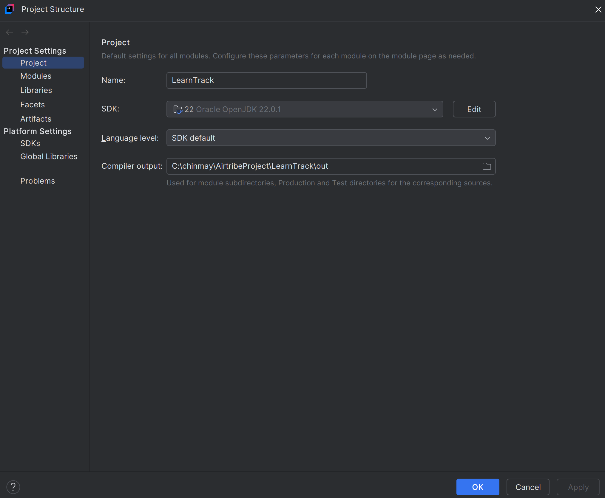
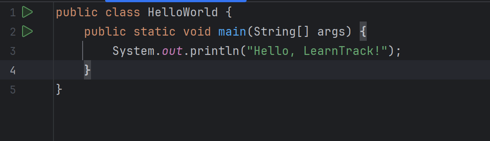
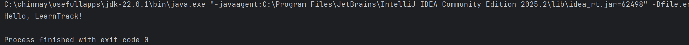

# Setup Instructions

## JDK Version Used

- **JDK**: Oracle OpenJDK 22.0.1
- **Configured In**: IntelliJ IDEA
- **Project SDK setting**:
    - Project name: `LearnTrack`
    - Project SDK: `22 Oracle OpenJDK 22.0.1`
    - Language level: `SDK default`

---

## Hello World Program

To verify the JDK and IDE setup, a simple **Hello World** program was created and run.

### Hello World Code

### How it was run in IntelliJ IDEA

1. Created a new Java class `HelloWorld` in the `src` folder.
2. Added the `main` method as shown above.
3. Right-clicked inside the editor → **Run 'HelloWorld.main()'**.
4. The **Run** console in IntelliJ showed:

**OUTPUT-**

---

## How to Run the Main Project

After Hello World worked, the same setup is used for the main project:

1. Open the project `LearnTrack` in IntelliJ IDEA.
2. Ensure **Project SDK** is set to `22 Oracle OpenJDK 22.0.1` (File → Project Structure → Project).
3. Open `com.airtribe.learntrack.Main`.
4. Run `Main.main()` from IntelliJ.
5. Use the console menu to interact with the Student & Course Management System.
